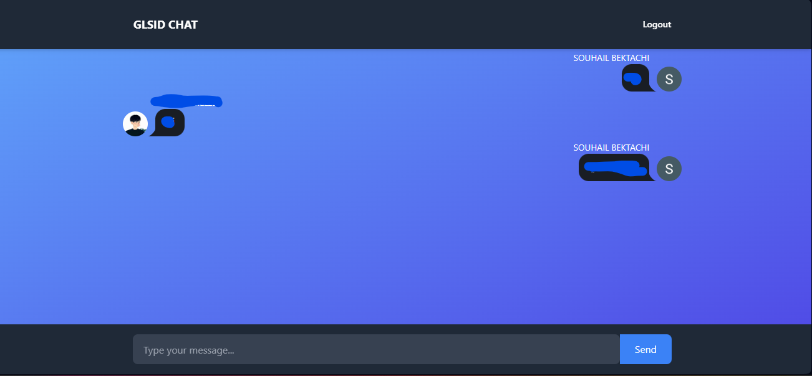

# Firebase Chat App with React




This is a simple chat application built using React and Firebase Realtime Database.

## Features

- Real-time messaging: Instantly see messages as they are sent.
- User authentication: Securely authenticate users with Firebase Authentication.
- Responsive design: Provides a seamless experience on both desktop and mobile devices.

## Technologies Used

- React: JavaScript library for building user interfaces.
- Firebase: A comprehensive platform for building web and mobile applications.

## Getting Started

### Prerequisites

Before you begin, ensure you have the following installed:

- Node.js:
- Firebase Account and create a new project.

### Installation

1. Clone the repository:

   ```bash
   gh clone souhailBektachi/chatapp-firebaserealtimedatabase
   cd firebase-chat-app
   ```

2. Install dependencies:

   ```bash
   npm install
   ```

3. Configure Firebase:

   - Create a new Firebase project in the [Firebase Console](https://console.firebase.google.com/).
   - Obtain your Firebase configuration object from the project settings.
   - Replace the placeholder values in `src/firebase.jsx` with your Firebase configuration.

4. Run the application:

   ```bash
   npm start
   ```
